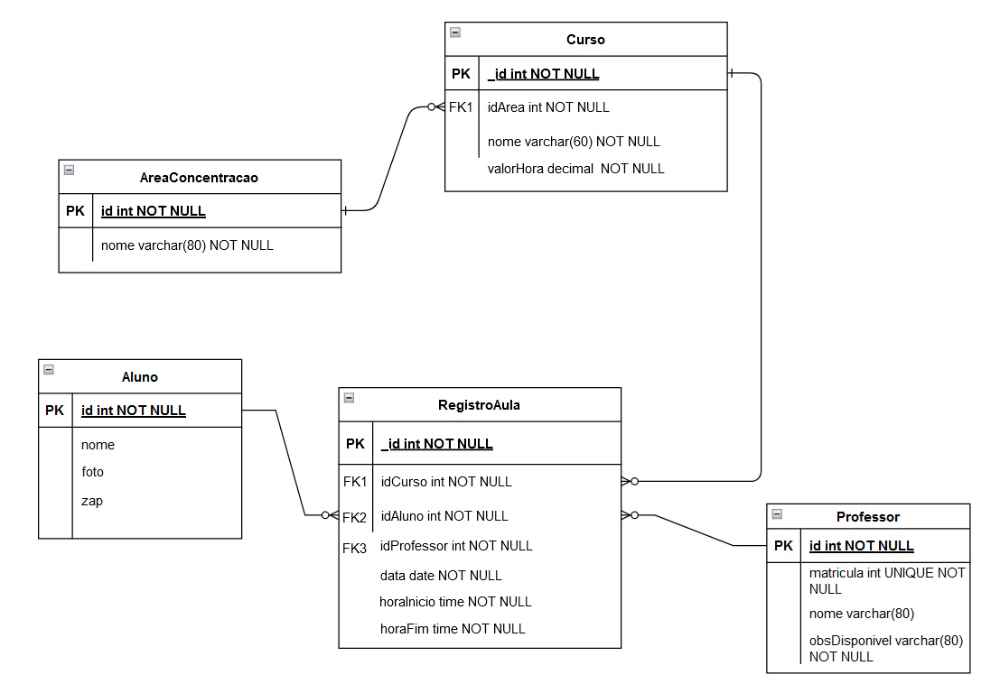

<h2>JKalang</h2>

Um projeto de aulas particulares para atender alunos. Essa aula vai estar associada em um curso e este terá uma área de especialização. O projeto terá o valor da aula e datas para auxiliar a regra de negócio para calcular o valor das aulas e mostrar tanto para o aluno como para o  professor um controle das aulas e dos valores das aulas.

Segue a modelagem conceitual do projeto: 

Segue conteúdo programático do treinamento: 

Branch	Descrição 
1	    Código Base no GitHub 
2	    README.md 
3	    Apresentação do Projeto 
4	    Requisitos Funcionais e Não Funcionais 
5	    Casos de Uso 
6	    Clone da Aplicação Base 
7	    Configurações iniciais no projeto 
8	    Buscando Professor 
9	    Criando o modelo do professor 
10	    Criando DTOs e Mappers 
11	    Implementando a rota de busca de professores 
12	    Detalhes do Professor – implementando as rotas e tratando exceções 
13	    Cadastro do Aluno + Manipular a Foto do Aluno 
14	    Cadastro do Curso, Cadastro da Área de Concentração, Cadastro da Aula 
15	    Validação do Email e Validação da Senha 
16	    Spring Security 
17	    Login + JWT 
18	    Atualizando professor e modificando para trabalhar com fotos 
19	    Listar os alunos 
20	    Excluir dados 
21	    Deploy do Projeto 

#Branch 1 - Código Base no GitHub
**O professor irá deixar o código base para o ínicio do treinamento**
*É importante conhecer o Git e GitHub, bem como realizar um curso básico de versionamento*
*Nesse link abaixo você possui o manual do markdown, para estudar sobre essa linguagem de formatação do seu README.md*
[Manual do Markdown](https://docs.pipz.com/central-de-ajuda/learning-center/guia-basico-de-markdown#open)

